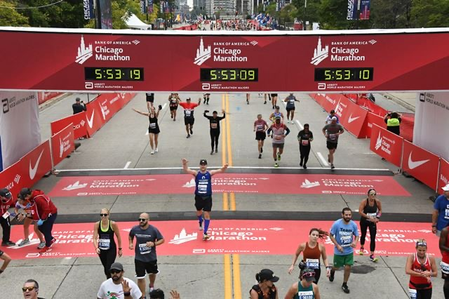
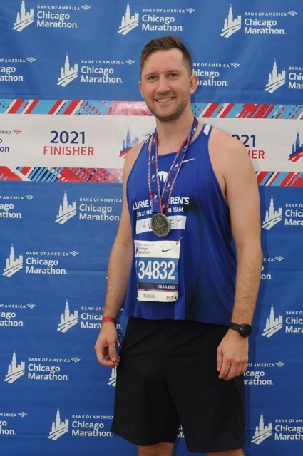
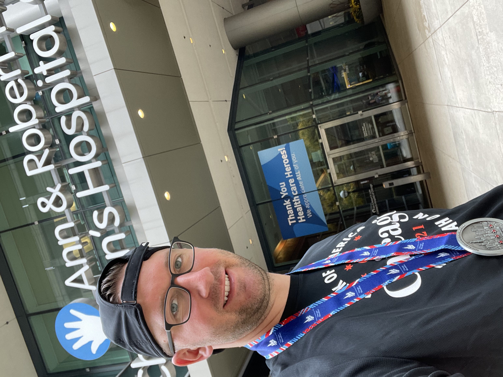

<head>
  <meta charset="utf-8">
  <title>Lightbox Example</title>
  <link rel="stylesheet" href="./lightbox/dist/css/lightbox.css">
</head>

<body>

# Bank of America Chicago Marathon 2021

{width=25%}\
<a href="images/marathon1.jpeg" data-lightbox="Marathon">Chicago Marathon Expo</a>

{width=25%}\
<a href="images/marathon3.jpg" data-lightbox="Marathon">Finish Line</a>

{width=25%}\

<a href="images/marathon4.jpg" data-lightbox="Marathon">Post Finish - Medal</a>

{width=25%}\

<a href="images/marathon5.jpg" data-lightbox="Marathon">Lurie Children's Hospital, Post-race Visit</a>

For more information, visit the  [Bank of America Chicago Marathon](https://www.chicagomarathon.com) official website 
  

</body>

</html>
